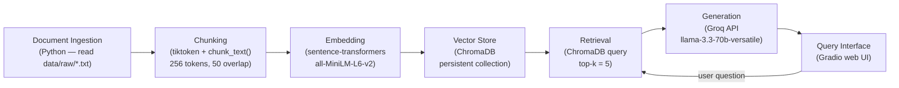

# Project 1 Planning: The Unofficial Guide

> I wrote this document before building the pipeline. I used it as the spec when prompting Claude for implementation guidance, and I updated the Retrieval Approach section after debugging retrieval in Milestone 4.

---

## Domain

This guide covers student-reported teaching style, exam format, workload, and grading for courses at the University of Central Florida (UCF), drawn from Rate My Professors reviews. Official course catalogs list prerequisites and topics but not how professors actually run exams, whether attendance matters, or how many hours students spend on homework. That information is scattered across individual review pages and hard to compare without reading dozens of profiles professor by professor.

---

## Documents

| # | Source | Description | URL or location |
|---|--------|-------------|-----------------|
| 1 | Rate My Professors | Kevin Pfeil — CS intro programming (COP3223/C), exam-heavy | https://www.ratemyprofessors.com/professor/2716334 |
| 2 | Rate My Professors | Mark Llewellyn — CS project-based classes (CNT4714), few/no exams | https://www.ratemyprofessors.com/professor/56126 |
| 3 | Rate My Professors | Paul Gazzillo — CS systems (COP3402), project + attendance | https://www.ratemyprofessors.com/professor/2425689 |
| 4 | Rate My Professors | Sarah Angell — CS intro Java (COP2500C), mixed difficulty reviews | https://www.ratemyprofessors.com/professor/1583836 |
| 5 | Rate My Professors | Jie Lin — CS security/systems (CIS3360, COP3402), tough grading | https://www.ratemyprofessors.com/professor/3129455 |
| 6 | Rate My Professors | Matthew Russo — Calc 1/3 (MAC2311, MAC2313), practice exams | https://www.ratemyprofessors.com/professor/2257316 |
| 7 | Rate My Professors | Heath Martin — Calc 2 (MAC2312), weekly quizzes + midterms | https://www.ratemyprofessors.com/professor/144315 |
| 8 | Rate My Professors | Nathan Holic — English writing (ENC1101), papers + discussions | https://www.ratemyprofessors.com/professor/646084 |
| 9 | Rate My Professors | Frank Logiudice — Biology (ZOO4513), exam-only grading | https://www.ratemyprofessors.com/professor/124775 |
| 10 | Rate My Professors | Paul Lawrence — Organic chemistry (CHM2210), flipped classroom | https://www.ratemyprofessors.com/professor/2833061 |
| 11 | Rate My Professors | Christian Heide — Physics 2 (PHY2054), optional attendance | https://www.ratemyprofessors.com/professor/3083403 |
| 12 | Rate My Professors | Matthew Chin — Psychology stats/research (PSY3204C), exams + papers | https://www.ratemyprofessors.com/professor/222145 |

---

## Chunking Strategy

**Chunk size:** 256 tokens

**Overlap:** 50 tokens (~20%)

**Reasoning:** Each source file is one professor's Rate My Professors profile (~1.7–2.4 KB, roughly 5 reviews). Individual reviews are short (often 30–150 tokens), so 256 tokens keeps most reviews intact in a single chunk while still allowing granular retrieval for specific questions (e.g., exam policy vs. lecture quality). Files are chunked independently — never across professors — so each chunk stays attributable to one source. Before splitting, each chunk is prefixed with professor name, department, school, and source URL from the file header. Reviews are split on `Review N (` boundaries first; fixed-token splitting with overlap is only applied when a single review exceeds 256 tokens. Overlap ensures that facts spanning a chunk boundary (e.g., a grading rule stated across two sentences) are still retrievable in adjacent chunks.

---

## Retrieval Approach

**Embedding model:** `all-MiniLM-L6-v2` via `sentence-transformers` (local, no API cost). It is fast, well-suited to short English text like student reviews, and integrates directly with ChromaDB.

**Top-k:** 5 chunks per query. With ~60 total chunks across 12 professors, retrieving 5 gives enough context to capture conflicting opinions without flooding the LLM with unrelated reviews.

**Production tradeoff reflection:** For a real deployment, I would weigh: (1) accuracy on informal student language — larger models like `e5-large` may better capture slang and course-code jargon; (2) latency — MiniLM runs locally in milliseconds vs. API round-trips; (3) context length — not critical here but matters for syllabus PDFs; (4) multilingual support — irrelevant for this UCF English-only corpus; (5) cost at scale — local MiniLM is free; API embeddings charge per token on re-indexing.

**Implementation update (Milestone 4):** After testing, I added professor-name and course-code metadata filtering when those appear in the query, keyword reranking within results, and a cosine-distance threshold to drop weak matches. Pure embedding search alone returned the wrong professor for some queries (e.g., Paul Lawrence instead of Paul Gazzillo on an attendance question).

---

## Evaluation Plan

| # | Question | Expected answer |
|---|----------|-----------------|
| 1 | What do students say about Kevin Pfeil's exam grading policy in COP3223C? | About 60% of the grade comes from 3 exams. At least one review warns that if the class exam average is below 70, students risk an F regardless of homework; another says exam review sheets don't match the actual exams. |
| 2 | How is Mark Llewellyn's CNT4714 class graded? | The entire grade comes from four individual projects (no exams, no groups). Projects involve Java GUIs and MySQL; students report spending roughly 10–25 hours per project with weeks to complete each one. |
| 3 | What is Paul Gazzillo's attendance policy for COP3402? | Attendance is mandatory, but students only need to attend at least 75% of lectures to meet the requirement. Reviews also mention extra credit for attendance. |
| 4 | How is Heath Martin's MAC2312 course graded? | 2–3 homework assignments per week, one weekly quiz (lowest two dropped), three midterms and a final; the final replaces the lowest midterm grade if it is higher. Tests are weighted heavily. |
| 5 | What teaching style does Paul Lawrence use for CHM2210, and what do students say about the workload? | Flipped classroom: students watch long lecture videos on their own time, with in-class work and participation. Reviews mention barely any homework, no study guides, pop quizzes, and that staying on top of videos is critical. |

---

## Anticipated Challenges

1. **Conflicting reviews for the same professor.** Kevin Pfeil has both glowing reviews and harsh warnings about exam policy. Retrieval may return only one side. Mitigation: top-k = 5 and instruct the LLM to report conflicting opinions.

2. **Wrong-professor retrieval when course codes overlap.** Jie Lin and Paul Gazzillo both teach COP3402. Mitigation: prepend professor metadata to every chunk; filter by professor name when the query names one.

3. **Low-signal chunks.** Some reviews are extremely short ("He is amazing.", "Goatzillo!") and can rank highly on generic queries while pushing out chunks with concrete grading details. Mitigation: minimum token threshold during ingestion; keyword reranking at retrieval time.

---

## Architecture

**Stage summary:**

| Stage | Tool / library |
|-------|----------------|
| Document Ingestion | Python `pathlib` — load plain-text files from `data/raw/` |
| Chunking | `tiktoken` for token counting; review-boundary splitting in `ingest.py` |
| Embedding + Vector Store | `sentence-transformers` (`all-MiniLM-L6-v2`) → `chromadb` in `data/chroma/` |
| Retrieval | `chromadb` cosine similarity, `top_k=5`, metadata filter + reranking in `retrieve.py` |
| Generation | `groq` Python SDK with grounded system prompt; API key from `.env` |
| Interface | Gradio web UI in `app.py` |

---

## AI Tool Plan

I used **Claude** (in Cursor) for guidance throughout the project — not to replace my own testing, but to help implement each milestone from this spec.

**Milestone 3 — Ingestion and chunking:**

- **Tool:** Claude
- **Input:** My Chunking Strategy section, sample `data/raw/kevin_pfeil.txt`, and `requirements.txt`
- **Expected output:** `ingest.py` to load `.txt` files, parse headers, split on review boundaries, chunk at 256 tokens with 50 overlap, prepend metadata, write `data/processed/chunks.json`
- **Verification:** Ran the script, confirmed 60 chunks, spot-checked that no chunk mixes professors

**Milestone 4 — Embedding and retrieval:**

- **Tool:** Claude
- **Input:** Retrieval Approach + Architecture sections, `chunks.json`, and `requirements.txt`
- **Expected output:** `embed.py` (ChromaDB + MiniLM) and `retrieve.py` with a `retrieve(query, top_k=5)` function
- **Verification:** Ran `test_retrieval.py` on eval questions; debugged wrong-professor matches and added metadata filtering myself after Claude's initial retrieval code

**Milestone 5 — Generation and interface:**

- **Tool:** Claude
- **Input:** Architecture section, Evaluation Plan, `.env.example`, assignment Gradio skeleton
- **Expected output:** `generate.py`, `query.py`, `app.py`, `main.py` — retrieve → Groq → grounded answer with programmatic sources
- **Verification:** Ran all 5 eval questions plus an out-of-corpus dining-hall question; confirmed sources appear in the UI separately from the LLM answer
